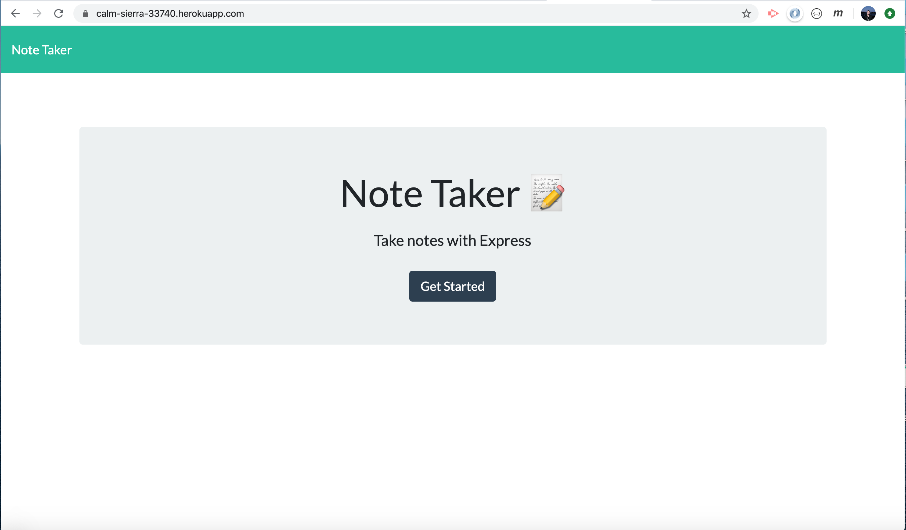
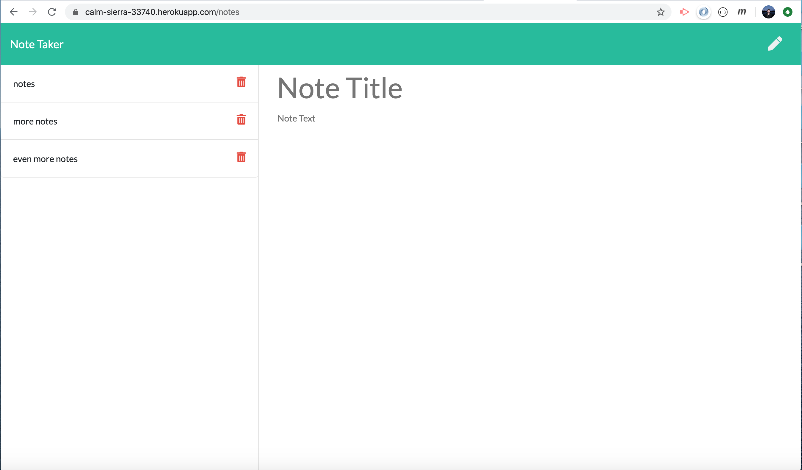
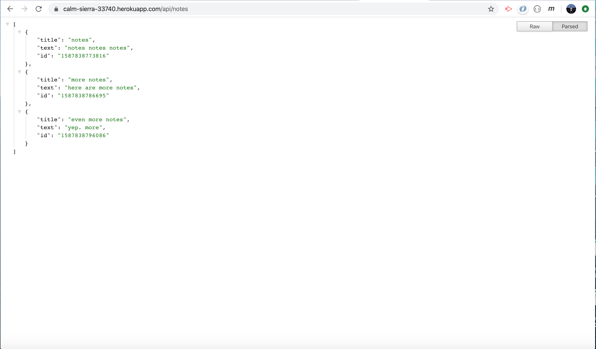

# Note-Taker

### **by Roger Pouncey** 

An application that can be used to write, save, and delete notes. This application uses an Express backend to save and retrieve note data from a JSON file.

Email: rpounceyjr@gmail.com

## **Table of Contents** 

#### i. [Installation](#installation)

#### ii. [Usage](#usage)

#### iii. [Contributing](#contributing)

#### iv. [Tests](#tests)

#### v. [Questions](#questions)

## **Installation** 
 
                $ npm i

## **Usage** 

This is a simple note-taking app that uses Express to create routes for various HTTP methods.  From the index page, users may click on the "Get Started" button.  This button will route them to the /notes page.  Here, they may enter a note title and text.  After both the title and text fields have received user input, a save icon appears in the top right corner of the navbar which allows users to post the note.  Once the save button is clicked, the note is saved to a JSON database using fs.writeFile.  When the page reloads, any stored notes are retrieved with a GET method and are appended to the list container on the left side of the page.  Users may click any of the listed notes titles to view the note title and contents in the middle of the page.  To create a new note after clicking one of these existing notes, the user simply clicks the pencil icon in the right corner of the navbar.

Users can access JSON-formatted information about notes through the /api/notes API page.  Along with the note title and text, each note is stored with a unique ID which is generated using Date.now() from the JavaScript Date library.  It is this ID that is used in the DELETE route that is employed when the user clicks the trash icon next to each entry.

This is app is deployed to Heroku.

## **Contributing** 

This project was created by Roger Pouncey.  Improvements can be made to the app by making a pull request on GitHub.

## **Tests** 

No tests were performed on this app.

## **Questions** 

Questions about this app can be addressed to Roger Pouncey, either through GitHub or via the above email address.